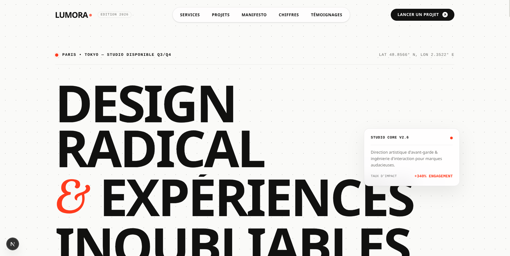

# LUMORA - Creative Studio & Digital Direction

A **high-end, avant-garde creative studio showcase website** built with Next.js 15 (App Router), TypeScript and Tailwind CSS, featuring Motion animations, scroll-driven visual transformations, custom physics-based cursor, magnetic interactions and a fully responsive layout.

---

## Features

- Monumental hero entrance with staggered letter/word reveals, mask overflow and dynamic blur-in
- Interactive 3D mouse parallax floating card reacting to cursor movement with spring physics
- Custom adaptive cursor with spring damping, expanding into an interactive "VIEW" badge on project cards and subtle glow on interactive elements
- Fixed navigation with magnetic links attraction, fluid animated pill indicator and full-screen mobile drawer with AnimatePresence
- Cascade card reveals with entry scale, subtle rotation and hover elevation on Services and Projects
- Dual-track horizontal infinite marquee with seamless continuous motion
- Scroll-driven showcase transforming frame scale, border-radius, rotation and progressively illuminating manifesto typography line by line (useScroll + useTransform)
- Interactive projects showcase with dynamic category filters and image zoom on hover
- Animated statistical counters smoothly incrementing upon viewport entry (useInView + animate)
- Editorial client testimonials slider with smooth AnimatePresence transitions and tactile pagination
- Ambitious main CTA button with magnetic liquid expansion effect, dual-layer vertical text roll and instant email copy with visual feedback
- Monumental masked typography reveal in footer with live ticking world clocks (Paris, Tokyo, New York)
- Strict accessibility compliance honoring prefers-reduced-motion via MotionConfig reducedMotion="user"
- Fully responsive — tablet and mobile breakpoints down to small devices

---

## Technologies Used

- **Next.js 15 (App Router)** – Modern React framework with Turbopack, static page generation and server-side optimization
- **TypeScript** – Strict type-safety across all components and data structures
- **Tailwind CSS v4** – Utility-first CSS framework with tailored design tokens, modern variables and responsive layouts
- **Motion (`motion/react`)** – Spring physics, scroll-driven transforms, layout animations and gesture orchestration
- **Lucide React** – Clean, lightweight vector iconography for all interface actions
- **Google Fonts (Geist & Geist Mono)** – Contemporary geometric grotesk typography

---

## Preview

